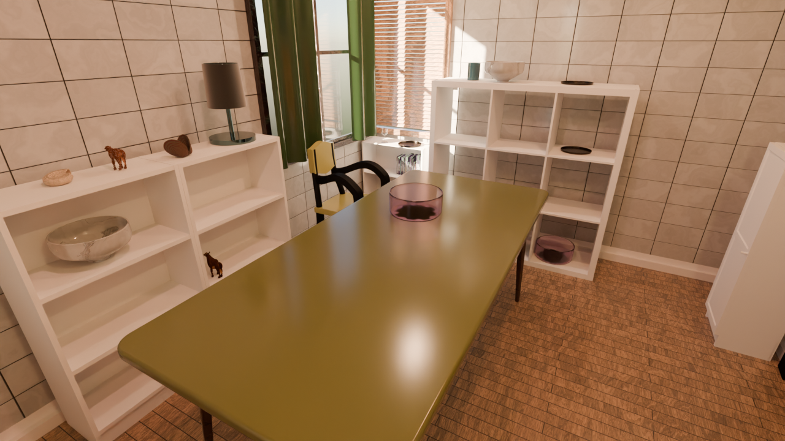

# Infinigen Hello Room

Infinigen's Hello Room dining-room example, generated with seed 0. The saved scene has embedded image assets and a preview camera aimed at the dining table.



## Files

- [Blender scene](outputs/hello_room/hello_room.blend): approximately 320 MB, stored with Git LFS.
- [PNG preview](outputs/hello_room/hello_room.png): 1280 × 720, Cycles, 256 samples, OpenImageDenoise.
- [Scene metadata](outputs/hello_room/scene_info.json): source revision, seed, scene counts, and camera settings.
- `scripts/`: installation, generation, packaging, and preview rendering.
- `requirements-lock.txt`: Python dependency versions used for generation. Infinigen itself is installed from the source commit below.

Run `git lfs install` and `git lfs pull` after cloning to download the Blender scene. Open it directly in Blender 4.2; no Infinigen installation is needed to view the packaged scene. It was verified in Windows Blender 4.2.1.

## Regenerate

Prerequisites: Ubuntu or Ubuntu WSL, Git, `uv`, a C/C++ compiler (`build-essential` on Ubuntu), Blender 4.2 for the final preview, and an NVIDIA GPU supporting CUDA. This run used an RTX 3080. On a minimal Ubuntu installation, Blender's Python module also needs the standard OpenGL/X11 runtime libraries (`libgl1`, `libegl1`, `libsm6`, `libxrender1`, `libxi6`, `libxfixes3`, `libxkbcommon0`, and `libgomp1`).

In Ubuntu/WSL, from this `hello_room` directory:

```bash
bash scripts/install_infinigen.sh
```

The installer clones the pinned Infinigen source and its required submodules into the ignored `work/` directory, creates a Python 3.11 environment, and installs the locked dependencies. The first build of scikit-image 0.19.3 can take several minutes. Infinigen installs its required Blender extensions on first launch.

Then either run from PowerShell in this directory:

```powershell
.\scripts\generate_hello_room.ps1 -BlenderPath 'C:\path\to\blender.exe'
```

Or run entirely from Linux with a Blender 4.2 executable on `PATH`:

```bash
bash scripts/generate_hello_room.sh
work/infinigen/.venv/bin/python scripts/package_hello_room.py
blender --background outputs/hello_room/hello_room.blend --python scripts/frame_hello_room.py
```

The generator reuses `outputs/hello_room/coarse/scene.blend` if present. It renders the original camera view, then the packaging and framing scripts produce the portable scene and table-centered preview. Logs, raw scenes, render passes, source checkouts, and environments are ignored by Git. The committed scene, preview, and metadata are the only tracked generated outputs.

## Provenance and settings

- [Official Hello Room guide](https://github.com/princeton-vl/infinigen/blob/v1.19.0/docs/HelloRoom.md).
- Infinigen v1.19.0, commit `01c39c7f7adcf7363ccbcc57c64410c69f4a4e7c`, with its pinned `infinigen_gpl` and `OcMesher` submodules. Infinigen source was not modified.
- `--seed 0`, `fast_solve.gin`, `singleroom.gin`, `compose_indoors.terrain_enabled=False`, and `restrict_solving.restrict_parent_rooms=["DiningRoom"]`.
- Generation used Blender 4.2.0 in Ubuntu WSL; the final preview used Windows Blender 4.2.1.
- The fast solver produced one dining chair and reported unmet chair-count constraints. Its placement decisions are retained. The final preview adds a camera because the original automatic camera looked away from the table; the original camera rig remains in the Blender scene.
- Setup uses a NumPy 1.26.4 build constraint for scikit-image 0.19.3 and explicitly installs PyYAML, which was absent from Infinigen's package metadata.

This folder intentionally excludes the downloaded Infinigen source, Blender binaries, Python environment, intermediate outputs, and unrelated repository work.
